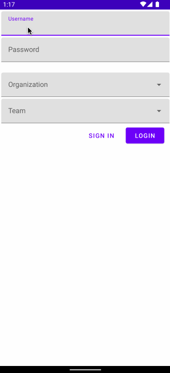

# EmployeeBonding

## Table of Contents
1. [Overview](#Overview)
1. [Product Spec](#Product-Spec)
1. [Wireframes](#Wireframes)
2. [Schema](#Schema)

## Overview
### Description

An app that connects employees (users) of a team in an organization and provides functionalities to post work-related discussions and share comments on informal activities such as events, games, etc. in a streamlined manner. 

### App Evaluation

- **Category:** Social Networking/Productivity
- **Mobile:** The app would primarily be designed for mobile devices, since they are personal devices and the app encourages an informal environment for workplace collaboration and bonding amongst peers.
- **Story:** Users can share a discussion post on a common organization/team board. Other users can view these new posts on their feed and share their comments upon opening the discussion post.
- **Market:** The app focuses on the employees of any organization that may consist of multiple  teams to encourage bonding amongst their department.
- **Habit:** This depends entirely on the employee depending on how socially involved he/she wants to be with his/her colleagues, whether during work hours to view a planned work-bonding event or during off hours. 
- **Scope:** Several features such as polls, game intergrations, and an event scheduler can make the app more robust and potentially be adopted by organizations to improve social interactions and bonding among their employees. This app focuses on the organization of activities within an organization, being a medium for communication and planning.

## Product Spec

### 1. User Stories (Required and Optional)

**Required Must-have Stories**

* Users can login/register according to the organization and team 
* Users can view all discussions posted by his/her team members on a feed, with the oldest posts at the bottom and the newest posts at the top
* Users can create a discussion post
* Users can add comments on an existing discussion post
* Users can see the dicussions that they have created 

**Optional Nice-to-have Stories**

* Users can create discussions based on categories
* Users can sort discussion on their feed based on categories
* Categories of discussion such polls and events can be intuitive
* Users can add attachments to the decription of a discussion. 
* Users can view all the discussion posts created by a particular user

### 2. Screen Archetypes

* Login/Register Screen
   * User is persisted once logged in
* Feed/Home 
   * User can see all discussions in his/her team
* User Discussion 
   * User can view all discussions created by him/her
* Create Discussion 
   * User can input a title for the discussion and add description. 
* A Discussion 
   * Upon clicking on a discussion, that discussion will be shown as a new activity on a new screen and prompt up a query of comments that may have been created for that specific discussion.

### 3. Navigation

**Expandable floating action button** 

* Create Discussion - Go to create discussion screen
* My Discussions - Takes user to screen where his/her posts are shown 
* Logout - Takes user to login/register screen and logs out the user

**Flow Navigation** (Screen to Screen)

* Forced Log in -> Login/Register if not logged in
* Feed/General Discussion -> User can click on a discussion to see full discussion and its comments
* Actions from Expandable floating action button - Described above
* Create Discussion -> Textfields: title and description. Description may have the ability to add attachments. Click on Create button to post discussion and return back to home to see an updated query of discussions, including the post that was just created by the user.
* A Discussion -> Has all the details regarding to the discussion. A text box is provided for the user to input a comment. A Post button that adds the comment to the discussion. Upon clicking the button would immediately add it to the query and be viewed at the bottom of the comments section of the post, including the timestamp it was created.

## Wireframes
[Add picture of your hand sketched wireframes in this section]


### [BONUS] Digital Wireframes & Mockups

### [BONUS] Interactive Prototype

## Schema 
[This section will be completed in Unit 9]
### Models
#### Organization 

   | Property      | Type     | Description |
   | ------------- | -------- | ------------|
   | objectId      | String   | unique id for the organization (default field) |
   | name          | String   | name of organization |
   
#### Team 

   | Property      | Type     | Description |
   | ------------- | -------- | ------------|
   | objectId      | String   | unique id for the organization (default field) |
   | teamName          | String   | name of the team |
   | parent_company | Pointer to Organization | A team belongs to an Organization |
   
   

#### Employee 

   | Property      | Type     | Description |
   | ------------- | -------- | ------------|
   | objectId      | String   | unique id for the employee (default field) |
   | name          | String   | name of employee |
   | worksAt      | Pointer to Team   | Employee belongs to a Team under an Organization |
   | user_link | Pointer to ParseUser | Link to the ParseUser |
   
   
#### Discussion 

   | Property      | Type     | Description |
   | ------------- | -------- | ------------|
   | objectId      | String   | unique id for the discussion (default field) |
   | title          | String   | title of the discussion |
   | description          | String   | description of the discussion |
   | createdBy      | Pointer to Employee   | employee who created the discussion |
   | createdIn | Pointer to Team | Will be used to query discussion created in a team thus, discussions are separated by teams|
   
#### Comment 

   | Property      | Type     | Description |
   | ------------- | -------- | ------------|
   | objectId      | String   | unique id for the comment (default field) |
   | commentText          | String   | Text content of the comment |
   | commentedIn      | Pointer to Discussion   | A comment belongs to a discussion |
   | commentedBy     | Pointer to Employee   | Employee who commented on a discussion |
   

### Networking
  - Home Feed Screen
      - (Read/GET) Query all discussions created in a team from an organization
```java

           ParseQuery<ParseObject> innerQuery = ParseQuery.getQuery("Organization");
           innerQuery.whereEqualTo("teamname", ParseUser.getCurrent().teamname);
           ParseQuery<ParseObject> query = ParseQuery.getQuery("Discussion");
           query.whereMatchesQuery(Discussion.KEY_ORGANIZATION, innerQuery);
           query.findInBackground(new FindCallback<ParseObject>() {
                public void done(List<ParseObject> commentList, ParseException e) {
                    //TODO
                }
           });
```

 - Create Discussion Screen
      - (Create/POST) Create a new Discussion Object with required title and description attribute and add object to the expanding query of discussion objects
```java
          ParseQuery<Discussion> discussionQuery = ParseQuery.getQuery("Discussion");
          List<Discussion> listOfdiscussions = new ArrayList<Discussion>();

          query.findInBackground(new FindCallback<Discussion>() { 
            public void done(List<Discussion> currentdiscussions, ParseException e) { // currentdiscussion is pulled from server
              if (e != null) {
                // TODO: there is an error, create a Toast
              }
              
              for (Discussion d : currentdiscussions) {
                // obtain information about discussion from server and add it to the arraylist
                Discussion viewd = new Discussion();
                viewd.setObjectId(d.getObjectId());
                viewd.setTitle(d.getTitle());
                viewd.setDescription(d.getDescription());
                viewd.setCreatedBy(d.getCreatedBy());
                view.setCreatedAt(d.getCreatedAt());
                listOfdiscussions.add(viewd);
              }

              ArrayAdapter<Discussion> adapter = new ArrayAdapter<Discussion>;
              // TODO: put into ArrayAdapter with context and our listOfdiscussions
            }
          }
 ```

 - User Discussions (Profile Screen)
      - (Read/GET) Display all discussions created by the user currently logged in 

```java
          ParseQuery<ParseObject> innerQuery = ParseQuery.getQuery("Organization");
          innerQuery.whereEqualTo("teamname", ParseUser.getCurrent().teamname);
          ParseQuery<ParseObject> query = ParseQuery.getQuery("Discussion");
          query.whereMatchesQuery(Discussion.KEY_ORGANIZATION, innerQuery);
          List<Discussion> userdiscussions = ArrayList<Discussion>();

          query.include("user");
          query.equalTo("user", user);
          query.find {
            // TODO: if successfully found, add to userdiscussions list and create adapter, much like discussion screen
          }
```

 - Discussion Screen (Add Comment)
      - (Read/GET) Fetch and view all the comments related to that discussion.
      - (Create/POST) Create a new Comment Object and push it to the associated discussion post

```java
          ParseQuery<Comment> discussionQuery = ParseQuery.getQuery("Comment");
          List<Comment> listOfcomments = new ArrayList<Comment>();

          query.findInBackground(new FindCallback<Comment>() { 
            public void done(List<Comment> currentcomments, ParseException e) {
              if (e != null) {
                // TODO
              }
              
              for (Comment c : currentcomments) {
                //gather info of the comment and add it to the comments arraylist
                Comment newComment = new Comment();
                newComment.setObjectId(c.getObjectId());
                newComment.setCreatedBy(c.getCreatedBy());
                newComment.setCreatedAt(c.getCreatedAt());
                listOfcomments.add(newComment);
              }

              ArrayAdapter<Comment> adapter = new ArrayAdapter<Comment>;
                //TODO
            }
          }
 ```
 ## Video Walkthrough

Here's a walkthrough of implemented user stories:





 
      
